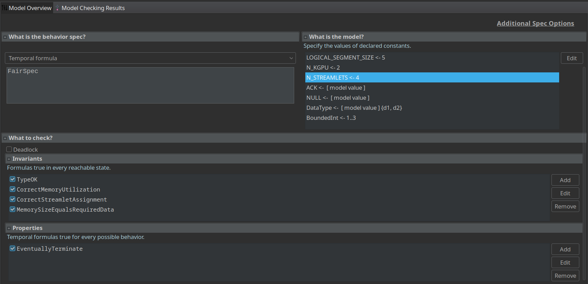

# TLA+ Project 2024

## Overview

This specification defines the interactions between a CPU and a GPU in a simplified system where the CPU provides data to the GPU. The specification includes the state and behavior of both entities and the communication mechanism between them.

## Repository Structure

- **src/main.tla**: The main TLA+ specification file describing the system model.
- **deliverables/first_design.jpg**: A sketch of the initial design implemented in the specification. (Note: Some elements may have changed since the initial design phase.)
- **deliverables/Project_Abstract.pdf**: Contains the project abstract.

## Setting Up TLC

To configure the TLC model checker set the constants as follows:

- **NULL**: Represents an empty memory slot. Set this to a model value.
- **ACK**: Serves as a placeholder for acknowledgment signal. Set this to a model value.
- **N_KGPU**: Specifies the number of GPU kernels.
- **N_STREAMLETS**: Defines the number of streamlets managing data.
- **LOGICAL_SEGMENT_SIZE**: Indicates the number of slots in each logical segment.
- **DataType**: Enumerates all possible data types handled by the system.
- **BoundedInt**: A bounded set of integers to mitigate state space explosion.

Adjust these values based on system requirements. Below are some suggested configurations based on my experience.

### Setup 1:
This configuration analyzes scenarios where the number of streamlets matches the number of GPU kernels.
- **N_KGPU**: 3
- **N_STREAMLETS**: 3
- **LOGICAL_SEGMENT_SIZE**: 4
- **DataType**: Set of Model Values -> {d1, d2}
- **BoundedInt**: 1..3

This configuration should complete in approximately 4 minutes.

### Setup 2:
This configuration is used to study cases where there are fewer streamlets than GPU kernels.
- **N_KGPU**: 3
- **N_STREAMLETS**: 2
- **LOGICAL_SEGMENT_SIZE**: 4
- **DataType**: Set of Model Values -> {d1, d2}
- **BoundedInt**: 1..3

Expect this configuration to take around 3 minutes to complete.

### Setup 3:
This setup examines scenarios where the number of streamlets exceeds the number of GPU kernels.
- **N_KGPU**: 2
- **N_STREAMLETS**: 4
- **LOGICAL_SEGMENT_SIZE**: 5
- **DataType**: Set of Model Values -> {d1, d2}
- **BoundedInt**: 1..3

This setup should complete in a few seconds.

### Example
A complete setup example should resemble the following.

## Liveness and Invariants

### Liveness Property
- **EventuallyTerminate**: Ensures the system will eventually reach a state where all GPUs have finished processing and the CPU is idle.

### Invariants
- **MemorySizeEqualsRequiredData**: Ensures each GPU in the "done" state has a memory load exactly matching the initially requested data.
- **CorrectMemoryUtilization**: Guarantees that upon reaching the "done" state, each GPU has processed all required data, correctly stored in memory, with associated logical segments cleared.
- **CorrectStreamletAssignment**: Prevents overlap and conflicts in GPU servicing by ensuring each streamlet is uniquely assigned to a GPU and multiple streamlets do not interfere with each other's operations.
